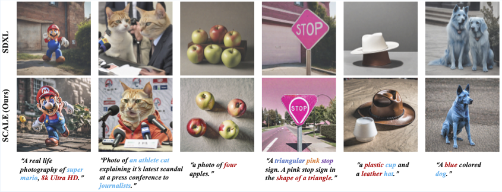

# SCALE
Our paper ***SCALE*** has been accepted by ECCV2026. 🎉🧨

## Overview

<p align="center">
  
</p>

**Official implementation of SCALE (Semantic‑Calibrated Guidance Enhancement)**, a training‑free guidance mechanism for text‑to‑image diffusion models that improves prompt faithfulness while preserving visual quality, introduced in the paper “SCALE: Semantic‑Calibrated Guidance Enhancement”, accepted to ECCV 2026.

**SCALE** is a novel train-free guidance mechanism for text-to-image diffusion models that resolves the quality-alignment trade-off by decoupling semantic enhancement from structural preservation.

1. **SAP Diagnosis (Semantic Alignment Projection)**: Probes the limits of alignment maximization by projecting sampling updates onto the guidance direction, revealing that one-dimensional constraints collapse the orthogonal corrective freedom essential for stable denoising.

2. **SCALE Mechanism (Semantic-Calibrated Guidance Enhancement)**: Selectively amplifies the semantic component along the guidance direction while preserving the orthogonal corrective component, achieved through:
   - **Minimal-Perturbation Extrapolation**: Scales only the semantic-axis component, leaving the orthogonal channel intact for structural stability.
   - **Orthogonal-Invariant Operator**: Acts as an axis-aligned linear operator that guarantees invariance on the orthogonal complement.

SCALE achieves state-of-the-art performance on DrawBench, GenEval, and T2I-CompBench with negligible inference overhead (≈0.38% over standard sampling), consistently improving prompt faithfulness without compromising visual fidelity.

## Abstract

Ensuring prompt faithfulness remains a central challenge for text-to-image diffusion models.
Classifier-Free Guidance (CFG) improves prompt adherence but exhibits an inherent quality--alignment tension:
increasing the guidance scale to strengthen conditioning on the prompt often degrades visual quality and introduces artifacts.
To probe the limit of alignment maximization, we first introduce **SAP** (**S**emantic **A**lignment **P**rojection), a greedy update rule that projects each sampling update onto the guidance direction to maximize per-step alignment progress.
We then show that SAP can fail due to the loss of orthogonal corrective freedom, discarding high-dimensional components that are crucial for rectifying accumulated trajectory drift.
Based on this diagnosis, we propose **SCALE** (**S**emantic-**CAL**ibrated Guidance **E**nhancement), a drop-in, training-free guidance mechanism.
SCALE improves semantic alignment while preserving structural fidelity by selectively amplifying the semantic component along the guidance direction while preserving the orthogonal component to retain corrective degrees of freedom.
Across multiple text-to-image benchmarks, SCALE delivers remarkable and consistent gains in prompt adherence and compositional alignment with negligible runtime overhead over standard sampling.

## Clone Repository

```bash
git clone https://github.com/Tianhang-Lu/SCALE.git
cd SCALE

python infer.py
```

## Start with [SDXL](https://github.com/Stability-AI/generative-models)

### Environment Setup

```bash
conda create -n scale python=3.10 -y
conda activate scale
pip install -r requirements.txt
```

### Download Models

| Model | Resolution | Checkpoint                                                   |
| :---- | :--------- | :----------------------------------------------------------- |
| SDXL  | 1024x1024  | [Hugging Face](https://huggingface.co/stabilityai/stable-diffusion-xl-base-1.0) or [ModelScope](https://modelscope.cn/models/stabilityai/stable-diffusion-xl-base-1.0) |

```bash
# pip install huggingface_hub
huggingface-cli download stabilityai/stable-diffusion-xl-base-1.0 --local-dir ./models
# pip install modelscope
modelscope download --model stabilityai/stable-diffusion-xl-base-1.0 --local_dir ./models
```

### Run with SDXL

```bash
python infer.py
```


## Acknowledge

Our codebase builds on [Z-Sampling](https://github.com/xie-lab-ml/Zigzag-Diffusion-Sampling). We appreciate their excellent work!

We thank the providers of the public datasets, including [DrawBench](https://imagen.research.google/), [GenEval](https://github.com/djghosh13/geneval), and [T2I-CompBench](https://github.com/Karine-Huang/T2I-CompBench).

For evaluation, we thank the open-source applications of [ImageReward](https://github.com/zai-org/ImageReward), [VQAScore](https://github.com/linzhiqiu/t2v_metrics), and [DSGScore](https://github.com/j-min/DSG).
